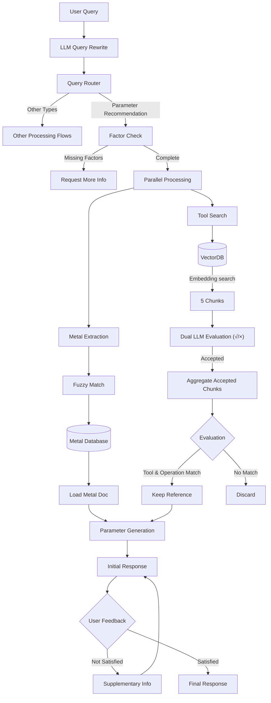

# Intelligent Manufacturing Parameter Recommendation System

An intelligent manufacturing parameter recommendation system built on LangChain and LangGraph, capable of intelligently recommending cutting parameters based on user queries.

## The README.md is mostly AI-generated then checked by me, will keep updating

## 🌟 Features

- Intelligent routing for different types of queries
- Smart metal material matching and parameter recommendations
- Tool parameter filtering and recommendations
- User feedback support and answer optimization
- Vector database-powered similarity search

## 🔄 Main Workflow


## 🤖 Component Details

### 1. Query Router (RAG.py)
- **Input**: Raw user query
- **Process**: 
  - Analyzes query content
  - Classifies into predefined types
- **Output**: Query type and routing decision
- **Types**:
  ```python
  QUESTION_TYPES = [
      "parameter_recommendation",
      "picture_reference",
      "web_search",
      "unknown"
  ]
  ```

### 2. Parameter Recommender (parameter_recommendator.py)
- **Input**: Classified parameter query
- **Process Steps**:
  1. Factor Completeness Check
     - Operation type
     - Metal/Material
     - Tool specification
     - Required parameters
  2. Metal Information Processing
     - Extract metal name
     - Fuzzy match with database
     - Load relevant documentation
  3. Tool Reference Processing
     - Search relevant tool info
     - Rate reference relevance
     - Filter applicable references
  4. Parameter Generation
     - Analyze metal properties
     - Consider tool requirements
     - Generate combined recommendations
- **Output**: Structured parameter recommendations

### 3. Metal Extractor (metal_extractor.py)
- **Input**: Query text
- **Process**:
  ```python
  # Metal extraction rules
  1. Specific codes (e.g., CCR-1150, TI-64)
  2. Generic metals (e.g., titanium alloy)
  3. Priority to specific codes
  4. Fuzzy matching with threshold 80
  ```
- **Output**: 
  - Metal name
  - Document path
  - Similarity score

### 4. Tool Search (tool_extrator.py)
- **Input**: Query and tool references
- **Process**:
  1. Vector similarity search
  2. Reference relevance rating
  3. Filtering based on:
     - Tool name match
     - Operation type match
- **Output**: Filtered relevant tool references

### 5. Rating System (rater.py)
- **Input**: Reference and query
- **Evaluation Criteria**:
  ```python
  1. Tool name matching
  2. Operation type matching
  3. Ignore material specifications
  ```
- **Output**: Relevance decision with reasoning

### 6. Retrieval System (retriever.py)
- **Input**: Search query
- **Features**:
  - Vector database management
  - Table data processing
  - Document chunking
- **Output**: Relevant document chunks

## 🔄 Feedback Loop Process

1. **Initial Response Generation**
   ```python
   result = router_workflow.invoke(query, config=config)
   ```

2. **Feedback Collection**
   ```python
   feedback = human_feedback().result()["feedback"]
   ```

3. **Response Optimization**
   - Maximum 3 iterations
   - Incorporates new information
   - Maintains context continuity

## 🛠️ Tech Stack

- LangChain: Workflow management
- LangGraph: Agent orchestration
- OpenAI GPT-4: Language processing
- ChromaDB: Vector storage
- Pydantic: Data validation
- RapidFuzz: Fuzzy matching

## 📝 Usage Example
```python
from RAG import RAG
# Create query
query = "What's the cutting speed for turning 1.4125 with D10?"
# Execute workflow
result = RAG.invoke(query, config={
"configurable": {
"thread_id": "unique_id"
}
})
```

### Query Example
```
I wanna machine 1.4125 with D10, cutting speed?
```

### System Response
```
Recommendations:

- Cutting Speed for 1.4125 Steel with D10 Tool:
  - Metal Source: 20-30 m/min
  - Tool Source: 60-120 m/min

Reasoning: The metal source suggests a cutting speed of 20-30 m/min for 1.4125 steel, which is a martensitic stainless steel with high hardness and wear resistance, making it difficult to machine. The tool source, however, recommends a higher range of 60-120 m/min for stainless steel using a D10 tool. Due to the conflicting ranges, both are presented, and the more conservative metal source range should be considered to ensure tool longevity and prevent excessive wear.
```

## �� Environment Setup

1. Create `.env` file:
   ```
   OPENAI_API_KEY=your_api_key_here
   ```

2. Required directory structure:
   ```
   project/
   ├── mappings/
   │   ├── metal_mappings.json
   │   └── table_mappings.json
   ├── VectorDBs/
   ├── washed_documents/
   └── markdowns/
   ```


