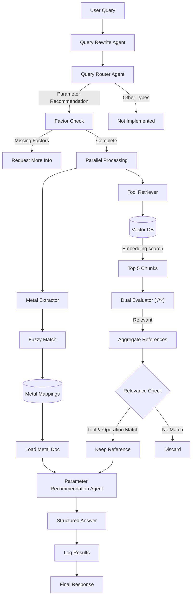

# Intelligent Manufacturing Parameter Recommendation System

An intelligent manufacturing parameter recommendation system built on LangChain and LangGraph, capable of intelligently recommending cutting parameters based on user queries.

## 🎉 Recent Updates

**v2.0 - Restructured Architecture** (Latest)
- ✅ Modular design with clear separation of concerns
- ✅ Configurable system prompts
- ✅ Type-safe Pydantic models
- ✅ Simplified agent architecture
- ✅ Enhanced maintainability and extensibility

## 🌟 Features

- Intelligent routing for different types of queries
- Smart metal material matching and parameter recommendations
- Tool parameter filtering and recommendations
- Vector database-powered similarity search
- Dual-evaluator relevance rating system
- Structured output with comprehensive logging

## 📁 Project Structure

```
backend/
├── config/              # Configuration management
│   ├── llm_config.py           # LLM configurations (OpenAI, Anthropic, DeepSeek)
│   └── prompts/                # System prompt templates
│       ├── query_rewrite.py
│       ├── factor_check.py
│       ├── parameter_recommend.py
│       └── relevance_rating.py
│
├── models/              # Pydantic models for structured output
│   ├── query_models.py         # NewQueries, Route
│   └── recommendation_models.py # Check, Answer, Feedback
│
├── data_processing/     # Data preprocessing and vectorization
│   ├── preprocessing.py        # Document preprocessing, table summarization
│   └── vectorization.py        # Smart chunking, vector DB creation
│
├── retrieval/          # Retrieval components
│   ├── vector_store.py         # ChromaDB vector store operations
│   ├── metal_matcher.py        # Fuzzy metal matching
│   ├── tool_retriever.py       # Tool reference retrieval
│   └── relevance_rater.py      # Dual-evaluator rating system
│
├── agents/             # Core agent logic
│   ├── query_agent.py          # Query rewriting and routing
│   └── recommendation_agent.py # Parameter recommendation
│
├── workflows/          # Workflow orchestration
│   └── rag_workflow.py         # Main RAG pipeline
│
├── utils/              # Utility functions
│   └── logger.py               # Result logging
│
├── legacy/             # Deprecated code (archived)
│   ├── online_search.py
│   ├── experiment.py
│   └── battlefield.py
│
└── main.py             # Entry point
```

## 🔄 Main Workflow


```mermaid
flowchart TD
    %% Initial Query Processing
    Start[User Query] --> LLM1[Query Rewrite Agent]
    LLM1 --> Router[Query Router Agent]
    Router --> |Parameter Recommendation| B[Factor Check]
    Router --> |Other Types| Other[Not Implemented]

    B -->|Missing Factors| C[Request More Info]
    B -->|Complete| D[Parallel Processing]

    %% Metal Processing Branch
    D --> F[Metal Extractor]
    F --> G[Fuzzy Match]
    G --> H[(Metal Mappings)]
    H --> I[Load Metal Doc]

    %% Tool Processing Branch
    D --> J[Tool Retriever]
    J --> K[(Vector DB)]

    %% Chunk Processing
    K -- Embedding search --> L[Top 5 Chunks]
    L --> M["Dual Evaluator (√/×)"]
    M -- Relevant --> N[Aggregate References]
    N --> Q{Relevance Check}
    Q -->|Tool & Operation Match| R[Keep Reference]
    Q -->|No Match| S[Discard]

    %% Parameter Generation and Response
    I --> T[Parameter Recommendation Agent]
    R --> T
    T --> U[Structured Answer]
    U --> V[Log Results]
    V --> X[Final Response]
```

## 🤖 Component Details

### 1. Query Processing (agents/query_agent.py)

**Query Rewriting**
- Splits multi-parameter queries into individual queries
- Improves retrieval effectiveness
- Returns: `List[str]` of rewritten queries

**Query Routing**
- Routes to appropriate handler
- Types: `parameter_recommendation`, `document_extraction`, `online_search`, `unknown`
- Returns: Route decision

### 2. Parameter Recommendation (agents/recommendation_agent.py)

**Factor Check**
- Validates query completeness
- Extracts:
  - Operation type (turning, milling, etc.)
  - Metal/Material
  - Tool specification
  - Questioned parameters
- Returns: `Check` model

**Parameter Recommendation**
- Metal document retrieval via fuzzy matching
- Tool reference retrieval via vector search
- Dual-source parameter integration
- Conflict resolution
- Returns: `Answer` model with structured recommendations

### 3. Retrieval System (retrieval/)

**Vector Store (vector_store.py)**
- ChromaDB-based similarity search
- Table content restoration
- Returns: Top-k relevant chunks

**Metal Matcher (metal_matcher.py)**
- Fuzzy matching with RapidFuzz
- Threshold: 80
- Supports main names and aliases
- Returns: `(metal_name, doc_path, score)`

**Tool Retriever (tool_retriever.py)**
- Vector search for tool references
- Relevance filtering
- Returns: Filtered relevant references

**Relevance Rater (relevance_rater.py)**
- Dual-evaluator system
- Primary: User-specified LLM
- Secondary: Claude Haiku (fallback)
- Focus: Tool name, operation, parameters (ignores material)
- Returns: `bool`

### 4. Data Processing (data_processing/)

**Preprocessing (preprocessing.py)**
- Image removal
- Table summarization via LLM
- Table placeholder replacement
- Returns: Cleaned markdown

**Vectorization (vectorization.py)**
- Smart chunking (preserves table integrity)
- Token-based splitting (max 1000 tokens)
- ChromaDB creation
- Returns: Persistent vector database

### 5. Workflow Orchestration (workflows/rag_workflow.py)

**Process Single Query**
- Routes query to appropriate handler
- Executes parameter recommendation
- Returns: `(response, is_successful)`

**RAG Pipeline**
- Query rewriting
- Multi-query processing
- Result logging
- Returns: Comprehensive results log

## 🔧 Configuration

### LLM Configuration (config/llm_config.py)

```python
# Available LLMs
llm_openai      # GPT-4o (default)
llm_anthropic   # Claude 3.7 Sonnet
llm_deepseek    # DeepSeek Chat
```

### System Prompts (config/prompts/)

All system prompts are centralized and configurable:
- `query_rewrite.py` - Query rewriting instructions
- `factor_check.py` - Factor validation rules
- `parameter_recommend.py` - Parameter recommendation logic
- `relevance_rating.py` - Relevance evaluation criteria

## 🛠️ Tech Stack

- **LangChain**: Workflow management
- **LangGraph**: Agent orchestration
- **OpenAI GPT-4o**: Language processing
- **Anthropic Claude**: Alternative LLM & dual evaluation
- **DeepSeek**: Alternative LLM
- **ChromaDB**: Vector storage
- **Pydantic**: Data validation
- **RapidFuzz**: Fuzzy matching
- **tiktoken**: Token counting

## 📝 Usage

### Installation

```bash
# Install dependencies
pip install -r requirements.txt
```

### Running the System

```python
# Simple usage
python main.py

# Programmatic usage
from config import llm_openai
from workflows import rag_pipeline

query = "What's the cutting speed for turning 1.4125 with D10?"
config = {"configurable": {"thread_id": "unique_id"}}

rag_pipeline.invoke((llm_openai, query), config=config)
```

### Using Different LLMs

```python
from config import llm_openai, llm_anthropic, llm_deepseek
from workflows import rag_pipeline

# OpenAI GPT-4o (default)
rag_pipeline.invoke((llm_openai, query), config=config)

# Anthropic Claude
rag_pipeline.invoke((llm_anthropic, query), config=config)

# DeepSeek
rag_pipeline.invoke((llm_deepseek, query), config=config)
```

### Data Preprocessing

```python
from data_processing import preprocess_document, create_vector_db

# Preprocess document
preprocess_document(
    input_path="pdfs/document.md",
    output_path="washed_documents/document.md"
)

# Create vector database
create_vector_db("washed_documents/document.md")
```

## 💡 Query Example

**Input:**
```
I wanna machine 1.4125 with D10, cutting speed?
```

**System Response:**
```
🔍 Questioned parameter: cutting speed
🔧 Metal's source: 20-30 m/min
🛠️  Tool's source: 60-120 m/min
🎯 Combined range: Conflicted - see both sources
💭 RagBot's thoughts: The metal source suggests 20-30 m/min for 1.4125
   martensitic stainless steel due to its high hardness. The tool source
   recommends 60-120 m/min for stainless steel with D10. Consider the
   conservative metal source range for tool longevity.
```

## 🛠️ Environment Setup

### 1. Create `.env` file:
```bash
OPENAI_API_KEY=your_openai_key
ANTHROPIC_API_KEY=your_anthropic_key  # Optional
DEEPSEEK_API_KEY=your_deepseek_key    # Optional
```

### 2. Required directory structure:
```
backend/
├── mappings/
│   ├── metal_mappings.json
│   └── table_mappings.json
├── VectorDBs/
├── washed_documents/
└── markdowns/
```

## 📚 Documentation

- **RESTRUCTURE_GUIDE.md** - Detailed restructuring guide
- **RESTRUCTURE_SUMMARY.md** - Restructuring summary

## 🎯 Design Principles

1. **Modular Architecture** - Clear separation of concerns
2. **Configuration over Code** - Prompts and configs externalized
3. **Type Safety** - Pydantic models for structured outputs
4. **Simplicity** - No over-engineering, straightforward functions
5. **Extensibility** - Easy to add new features and workflows

## 🚧 Future Enhancements

- [ ] Web-based UI
- [ ] REST API endpoints
- [ ] Multi-language support
- [ ] Enhanced caching
- [ ] Batch processing
- [ ] Performance monitoring

## 📄 License

This project is for research and educational purposes.
